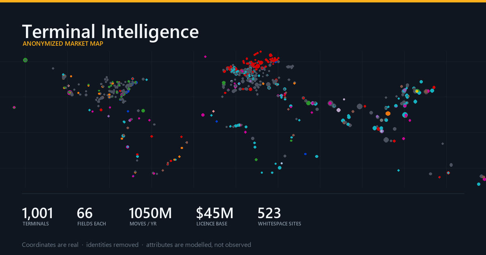

# Terminal Intelligence — Anonymized Market Map

An interactive, single-file analytics dashboard over **1,001 container terminals, rail
intermodal yards and industrial sites** worldwide — modelling how gate/crane/rail OCR
vendors are distributed across the global port universe, where the whitespace is, and
when incumbent contracts come up for renewal.

**[▶ Live demo](https://LLLL2000.github.io/terminal-intelligence-map/)**



No build step, no server, no framework. One HTML file, ~1.5 MB, opens straight from disk.

---

## ⚠️ Read this before you read anything else

This is a **de-identified, partly synthetic** derivative of a private market map.
Two different things are going on in the same file:

| | |
|---|---|
| **Real** | Site coordinates (public container terminals, rail yards, industrial sites), the facility taxonomy, the region split, and the Confirmed / Inferred / Conflict / TBD attribution grading. |
| **Anonymised** | Every vendor, operator and site name. Vendors are `Company 1…15`, operators continue the same identifier pool, sites are `Site <id>`. All source references, evidence text and URLs were dropped. |
| **Modelled** | *Every* operational, contractual and commercial attribute — throughput, equipment counts, OCR accuracy, contract dates, licence value, risk scores. These are **generated**, not measured. |

**Nothing here is a fact about any real port, operator or vendor.** What it does
demonstrate is a data model, an analysis layer, and a rendering approach.

The app says so itself: a disclosure banner on load, and a Methodology tab with a
per-field provenance table tagging every field `observed` / `anonymised` / `modelled`.

### Why synthetic?

The private version carries exactly one attributed field per site: which vendor's
system is installed. That's enough to draw a footprint map and not much else.

This build asks a different question — *what would a complete per-terminal intelligence
record look like, and what analysis would it unlock?* — so it carries the full 66-field
schema and fills it from a model.

The generator is **deterministic**: every value is a hash of the site id and the field
name. Builds are reproducible and diffable, and the fields stay consistent *with each
other* rather than being independently random:

- crane and berth counts follow throughput
- truck turn time follows gate automation and lane count
- OCR accuracy follows vendor tier and upgrade recency
- licence value follows throughput, channel breadth and sales channel
- displacement risk is a real formula over contract proximity, accuracy gap,
  integration depth, support tier and upgrade age

The distributions are plausible. The individual values are fiction.

---

## What's in it

Seven tabs, all driven by one sticky filter bar (region · facility type · attribution
status · automation level · vendor · size class · full-text search), plus a metric
switch that repoints every chart between **site count**, **throughput** and
**licence value**.

### Overview
Eight KPIs (covered volume, installed licence base, open opportunity, contracts
expiring ≤24 months, HHI concentration), vendor share, vendor mix by region with a
100%-stacked toggle, an adoption timeline stacked by vendor with annual/cumulative
toggle, attribution-quality and freshness donuts, and a sortable top-N table with
inline throughput sparklines.

### Vendors
Sortable 12-column leaderboard, then a profile for the selected vendor: modelled
identity card, regional footprint, OCR channels held, install cohort, contract runway,
largest sites — plus a **head-to-head comparison** against any rival with
directionally-correct relative bars (lower truck turn and lower risk score as wins).

### Technology
A **vendor × OCR-channel heat matrix** (channels held or throughput covered), an
interactive scatter with five selectable Y-axes and four colourings (bubble size =
licence value, click any point to open the record), automation posture by region,
mean accuracy by incumbency band, feature adoption, and an OCR-vendor × TOS crosstab.

### Pipeline
Weighted pipeline value, renewal runway by year stacked by incumbent, a region ×
years-to-renewal pressure heatmap, unattributed value by region, a qualification
funnel, and a ranked target list scoring whitespace wins and incumbent displacements
on one comparable axis (`deal value × probability × timing`).

### Database
All 66 fields as **57 selectable columns**, grouped column chooser, sort on any column,
pagination, and CSV export of either the visible view or the complete field set.

### Map
Leaflet map of all 1,001 sites. Marker **shape** = facility type, **size** = throughput,
**fill** = attribution status, **outline** = engagement type (direct / reseller /
source conflict / web-inferred). Optionally inherits the dashboard filters.

### Methodology
Field-by-field provenance, coverage stats, vendor taxonomy, and definitions.

Click any row, bar or point anywhere in the app to open a full 66-field record drawer.

---

## The data model

66 fields per terminal.

| Group | Fields |
|---|---|
| **Identity** | `id` `name` `region` `segment` `type` `size_class` `operator` `multi_op` `lat` `lon` |
| **Attribution** | `vendor` `status` `mm_claim` `df_claim` `confidence_score` `data_completeness` `internet_inferred` `confidence` `last_verified` `freshness` |
| **Capacity** | `volume` `volume_unit` `vol_history[5]` `cagr_3y` `berths` `quay_m` `depth_m` `yard_ha` `annual_trucks_k` |
| **Equipment** | `sts_cranes` `yard_cranes` `reach_stackers` `gate_lanes` `reefer_plugs` `on_dock_rail` `rail_tracks` |
| **OCR stack** | `ocr_stack{Gate,Crane,Rail,Yard/UTR → vendor + year}` `ocr_channels` `channel_count` `multi_vendor` |
| **Systems** | `tos` `integration` `hosting` `automation` `gate_automation_pct` `anpr` `damage_ai` `weighbridge_link` |
| **Performance** | `ocr_accuracy` `uptime_pct` `truck_turn_min` `gate_moves_hr` |
| **Commercial** | `acv_kusd` `tam_kusd` `sales_channel` `support_tier` `install_year` `last_upgrade_year` `contract_years` `contract_end` `refresh_due_yrs` `incumbency_yrs` `displacement_risk` `deal_stage` |

Two modelling decisions worth calling out, because they're what make the analysis work:

**OCR channels are drawn independently.** A site can run different vendors on its gate,
crane, rail and yard channels. That's what produces the 152 multi-vendor sites — and
it's the wedge the Technology tab is built to expose.

**Whitespace has no licence value.** `acv_kusd` is `null` for unattributed and in-house
sites rather than defaulting to a number, so installed-base totals can't be silently
inflated by sites nobody has sold to. Whitespace carries `tam_kusd` instead.

`data/terminals_anonymized.json` is the same dataset as a standalone file if you want
it without the UI.

---

## Build pipeline

```
index2.html (private)
   |
   +- 1. ANONYMISE   vendors + operators -> "Company N", sites -> "Site <id>",
   |                 all free text, sources, evidence and URLs dropped.
   |                 Coordinates kept - geography is public.
   |
   +- 2. EXTEND      +234 candidate public terminal coordinates, de-duplicated
   |                 against the base universe at 8 km great-circle distance.
   |                 155 survived. Vendor/status drawn from region-specific priors.
   |
   +- 3. ENRICH      Each record expanded to the full 66-field profile from a
   |                 deterministic hash seed.
   |
   +- 4. ASSEMBLE    Emit one self-contained HTML file from src/tpl3/.
```

Step 4 rebuilds the page **from templates in this repo** rather than patching the
private source, so there's no path for prose from the private file to survive into the
public one by accident. Verified by a token-set diff of the two files' vocabularies:
zero company, operator, port or city names, zero URLs, zero file paths.

```bash
python src/build_index3.py
```

> Won't run from this repo — it needs the private `index2.html` and a git-ignored
> `private/identity_map.py` holding the only two mappings that name real entities.
> The script is included because the pipeline is the interesting part; the shipped
> `index.html` is its output.

---

## Layout

```
index.html                  the app - open it directly, no server needed
data/
  terminals_anonymized.json the dataset on its own
src/
  build_index3.py           anonymise -> extend -> enrich -> assemble
  tpl3/
    ports_seed.py           additional public terminal coordinates
    enrich.py               the deterministic attribute model
    styles.css  body.html   page shell
    core.js                 state, filtering, formatting, record drawer, CSV
    charts.js               SVG chart primitives (no charting library)
    dashboard.js  vendors.js  technology.js  pipeline.js  database.js
    map.js  methodology.js  boot.js
```

## Technical notes

- **No framework, no build tooling, no charting library.** Every bar, column, donut,
  scatter, heatmap, funnel and sparkline is hand-rolled SVG in `charts.js` (~14 KB).
- Only external dependency is **Leaflet 1.9.4** plus CARTO basemap tiles, and only the
  Map tab needs them — the five analytical tabs work fully offline.
- Charts are strings; interactivity is delegated via `data-tip` / `data-act` attributes
  and two document-level listeners, so re-rendering a whole tab needs no teardown.
- Views render lazily and mark themselves dirty on filter change.
- ~2,000 lines of JS, ~600 of Python.

## Licence

Not yet specified — add one before reuse.
